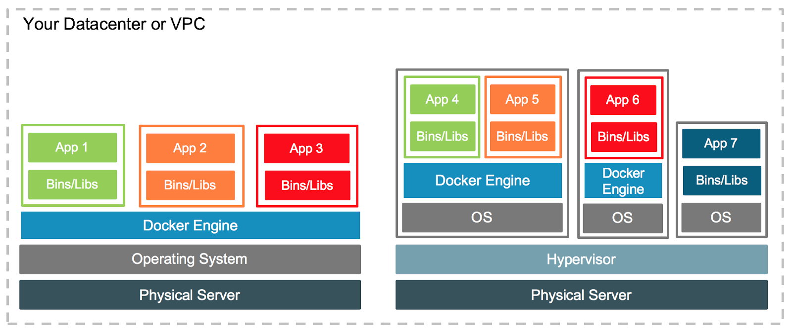
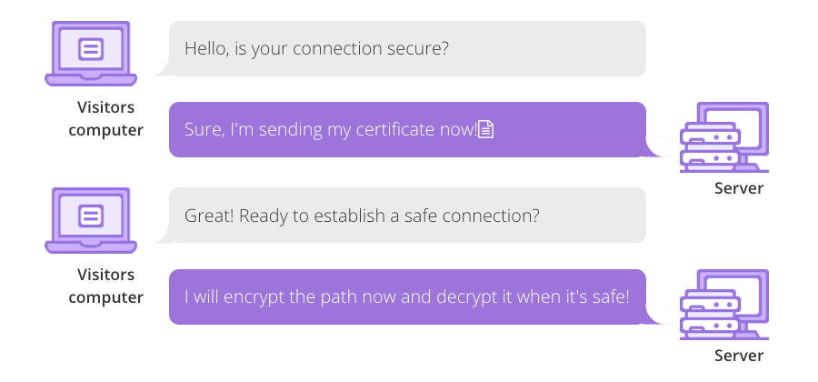
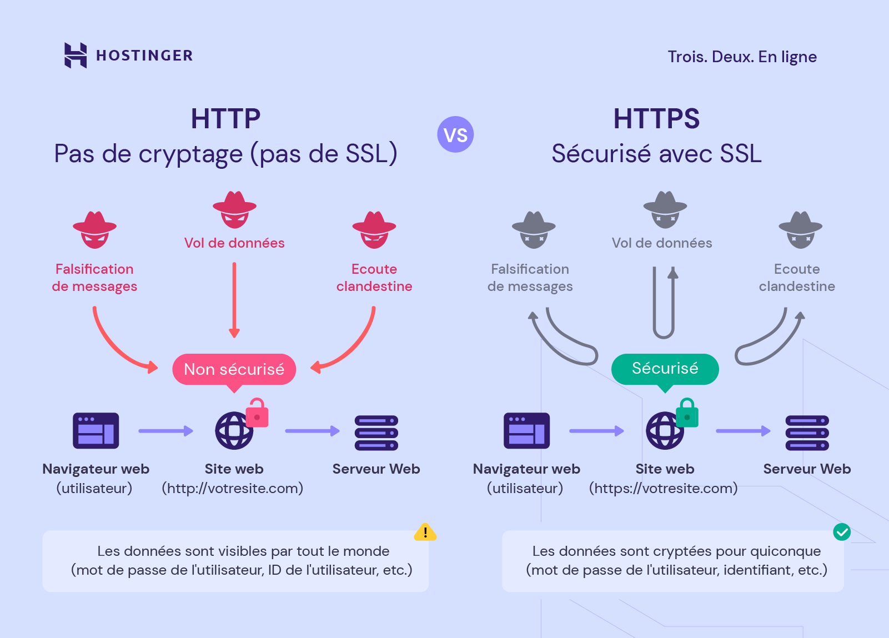

# Inception

Ce projet a pour but :   
- apprendre a utiliser Docker.  
- approfondir les connaissances en systeme d'administration.  

#### Machine virtuelle
Un environnement entierement virtualisee qui fonctionne sur une machine physique. Elle execute son propre OS et bénéficie de ses propres ressources materielles : CPU, mémoire RAM, disque dur et carte réseau.  

#### Conteneur
Un conteneur est une unité de logiciel qui contient tout ce dont une application a besoin pour fonctionner : le code, les bibliothèques, les dépendances, etc. Les conteneurs partagent le même noyau du système d'exploitation, mais sont isolés les uns des autres.  



>Tous les deux permet d'isoler une application et augmenter sa portabilite. Cependant, un conteneur consomme moins de ressources et se demarre bcp plus vite que le vm. Il est aussi plus facile a gerer et orchestrer. Et peut etre utilise sur tout type d'ordinateur qui supporteun moteur de conteneurisation compatible.  

## Docker
C'est un plateforme de conteneurs lancee en 2013 qui permet de creer facilement des conteneurs et des applications bases sur des conteneurs. [Docker.docs](https://docs.docker.com/desktop/)  

#### Dockerfile
Un fichier de configuration contenant une série d'instructions pour construire une image Docker. Chaque instruction dans un Dockerfile crée une couche dans l'image Docker.

#### Image Docker
Un modèle en lecture seule qui permet d'instancier un conteneur Docker executable.

#### Volume Docker
Un mecanisme pour conserver les données au-delà du cycle de vie d'un conteneur, une unite de stockage cree par Docker.  

#### Docker Compose
Un outil pour definir et gerer des environnements muti-conteneurs. Il permet de demarrer, arreter et configurer des ensembles de conteneurs ensemble avec un fichier de configuration `Docker-compose.yml` et des lignes de commande. [En savoir plus](https://datascientest.com/docker-compose-tout-savoir)  

#### DockerHub
Registre officiel du Docker, permet de trouver, utiliser et partager les images Docker.   

### Comment fonctionne Docker ?

#### Architecture  


Docker contient un Docker CLI (Command Line Interface) qui recoit les commandes d'utilisateurs et les envoie ensuite a Docker Daemon.  
Docker Daemon est un processus persistent de gestion execute en arriere-plan. Selon les commandes recues, il executera des taches correspondantes.  
Il gere les images, les conteneurs, les reseaux, les volumes et la communication avec des API Docker.

#### Les commandes Docker
```bash
docker --help				# aide commande Docker 
docker < command > --help   # aide commande spécifique Docker

docker ps -a		# Lister tous les conteneurs,quel que soit leur etat
docker images		# Lister les images Docker
docker rm < id/name >		# Supprimer un conteneur
docker rmi < id/name >		# Supprimer une image
docker logs < id/name >		# Afficher les logs d'un conteneur
docker start/stop/restart < id/name >	# Dém/Arr/Red un conteneur

# Construire une image à partir d'un Dockerfile
# tag: specifie la version de cette image, pas obligatoire, par defaut: latest
docker build -t < image_name >:< tag > < path_Dockerfile_directory >

# creer le conteneur, -d=en mode detache, -p lier les ports
docker run -d -p port_hote:port_container --name nom_container < image_name >

# docker exec -it < id/name > < command > # Exécuter une commande dans un conteneur
# docker network ls	# Lister les réseaux Docker
# docker volume ls	# Lister les volumes Docker
# docker-compose build	# Construire les images du fichier docker-compose.yml
# docker-compose up/down	# Lancer/Arreter les services du fichier docker-compose.yml

```

## Web

### Nginx


### Fonctionnement du protocol SSL/TLS
Secure Sockets Layer/Transport Layer Security utilise le chiffrement pour sécuriser les données des utilisateurs, authentifier l'identité des sites web et empêcher les attaquants de falsifier les communications sur Internet.



[En savoir plus](https://www.cloudflare.com/fr-fr/learning/ssl/how-does-ssl-work/)



#### WordPress
un systeme de gestion de contenu gratuit, libre, et open-source, permet de creer et gerer differents types de site Web.  


### Fonctionnement du Systeme de Gestion de Base de Donnees (SGBD)
un logiciel permettant aux utilisateurs finaux de manipuler les données d’une database. Par exemple, récupérer, ajouter, modifier, compresser, extraire ou supprimer des données. Sans SGBD, la base de données n’est pas fonctionnelle.  
[En savoir plus](https://datascientest.com/sgbd-tout-savoir)

#### MariaDB
un système de gestion de base de données relationnelle open-source, qui est un fork de MySQL.  
#### FastCGI
mode ameliore du CGI original, est un protocole de communication qui permet au serveur web de communiquer efficacement avec des applications backend.  
#### Php-fpm
FastCGI Process Manager, une application backend du php, integrant le protocole FastCGI, qui maintien un nombre configure de processus pour executer des scripts php et ensuite etre reutilise une fois de nouveau livre, il permet de gerer plus efficacement l'execution des scripts PHP.  

>Le serveur et l'application backend se communique a l'aide du protocol FastCGI et d'une socket, en suivant le principe du client-serveur.  


## Systeme d'administration

connexion root : su -
pour qu'un user puisse utilser sudo :
	- ajouter le dans le groupe sudo
	- configurer les doits avec "sudo visudo"
lors d'utilisation de sudo par user : mdp de connexion user et non celui du root!

## Autres termes
#### YAML
un format de representation de donnees par serialisation (methode de codage d'une information en informatique) Unicode.  
#### Alpine
une distribution de Linux minimaliste et securisee, idéale pour les environnements conteneurisés, les systèmes embarqués et les serveurs minimalistes.  
#### Debian
une distribution Linux populair, open source et libre, developpe par une communaute de benevoles. Elle est stable, robuste et a une vaste depot de logiciels.  
#### latest
est utilisé pour désigner la dernière version d'une image Docker.  
#### hacky-patch
un terme informel utilisé pour décrire une solution temporaire ou improvisée apportée pour résoudre un problème dans un logiciel ou un système. Décrit une solution qui, bien que fonctionnelle, n'est pas idéale ou élégante.  
#### tail -f
un outil essentiel pour surveiller les fichiers de log et d'autres fichiers en temps réel dans les systèmes Unix et Linux. Elle fournit une vue en continu des nouvelles lignes ajoutées à un fichier, ce qui est particulièrement utile pour le débogage, la surveillance des systèmes, et l'analyse des données en temps réel.  
#### host
commande pour obtenir les infos DNS s'un nom de domaine, syntaxe : host [options] [nom de domaine].  
#### link
command pour creer un lien physique d'un fichier, syntaxe : link fichier1.txt lien1.txt  
#### links
un logiciel libre, navigateur de web en mode texte.  
#### PID 1
le premier processus créé par le noyau après le démarrage du système, generalement appele init ou systemd. Il est chargé de lancer les services système, de gérer les processus en cours, et d'assurer le bon fonctionnement général du système.  
#### port 443
port standard pour HTTPS, utilisé pour sécuriser les communications sur Internet.  


## Informations importantes du sujet

